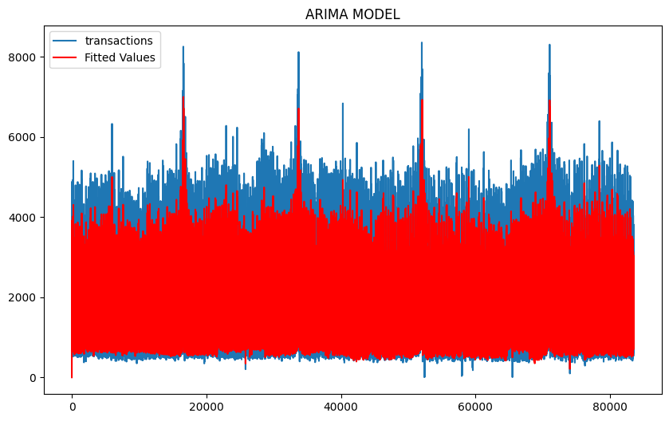

# Quantitative-Model
Building a quantitative model  to Predict future Business activities
## <b><u> Time series Forecasting for Favorita Store Sales </b></u>
   - `In this project we will be building a regression model and understand hw to use it`
   - `We will also examine the correlation coeffcient,multiple regression  and logisti regression methods`
   - `using logistic regression we will be able to estimate the probability of the business success over give period of time`
   - `finally; develop a time series Analysis`
 ### <u><b><i> Description </u></b></i>
` As a data scientist, I will be looking at a favorita  grocery stores data  and predict a little over time based on th sales performance previously... </ `
 - The Favorita Grocery Sales Forecasting competition is a time series forecasting competition hosted by the Favorita Food Markets Association. The goal is to predict the sales of various products sold in multiple locations over time. The dataset provided includes sales data, promotions, and other relevant features.
 - `The dataset includes;;;;;;;;;;;;`
- train.csv: includes store_number, family, onpromotion and target sales
- test.csv: same as train.csv(predict sales data)
- transaction.csv: date,store_number,transation 
- sample_submission.csv: 
- stores.csv: store metabase including city, state,type and cluster
 - oils.csv: daily oil price
 - holidays_events.csv: Holidays events
## Questions
 1. Is the train dataset complete (has all the required dates)?
 2. Which dates have the lowest and highest sales for each year (excluding days the store was closed)
 3. Compare the sales for each month across the years and determine which month of which year had the highest sales. 
 4. Did the earthquake impact sales?
 5. Are certain stores or groups of stores selling more products? (Cluster, city, state, type)
 6. Are sales affected by promotions, oil prices and holidays
 7. What analysis can we get from the date and its extractable features?
 8. Which product family and stores did the promotions affect.
 9. What is the difference between RMSLE, RMSE, MSE (or why is the MAE greater than all of them?)
 10. Does the payment of wages in the public sector on the 15th and last days of the month influence the store sales.
 ### <u><b><i> HYPOTHESIS</u></b></i>
Null hypothesis;`The type of holiday does not have any significance on the increase of sales`
Alternative hypothesis; `The type of holiday do have significant on the increase of sales`
#### <i><u> handling missing values</u></i>

` for this case we have value mising on the dcoil on the data file and we will use back fill method because;`

- because the data is a time sries  and missing values is due to temporary gaps like holidays or weekends 
- we will assume the secondly recorded values remains valid
### <b><u> Checking for stationarity</u></b>
    - checking for stationarity in a time series column[date] is very necessary for understanding the statistical propertes of the dataset and determine in the appropriate model technidue to use
A time series is statinary if the statisitical properties [mean,variance add covariance] remain consant over time
- ARIMA and SARIMA models assume stationarity 
### Fit ARIMA Model
ARIMA REQUIRES 3 PARAMETERS:
- p(AR):Autoregressive terms
- d(I):Differencing order
- q(MA): Moving Average
Here we will use first order differencing to make the data stationary

## FEATURING ENGINEERING
>STEP 1: FEATURE TRANSFORMATION 
- 1.Scaling
- 2.Encoding categorical variables
- 3.Log Transormation
>STEP 2:FEATURE SCALING
- 1. remove redundant feature
- 2. statistical test
- 3. feature importance 
>STEP 3: FEATURE CREATION